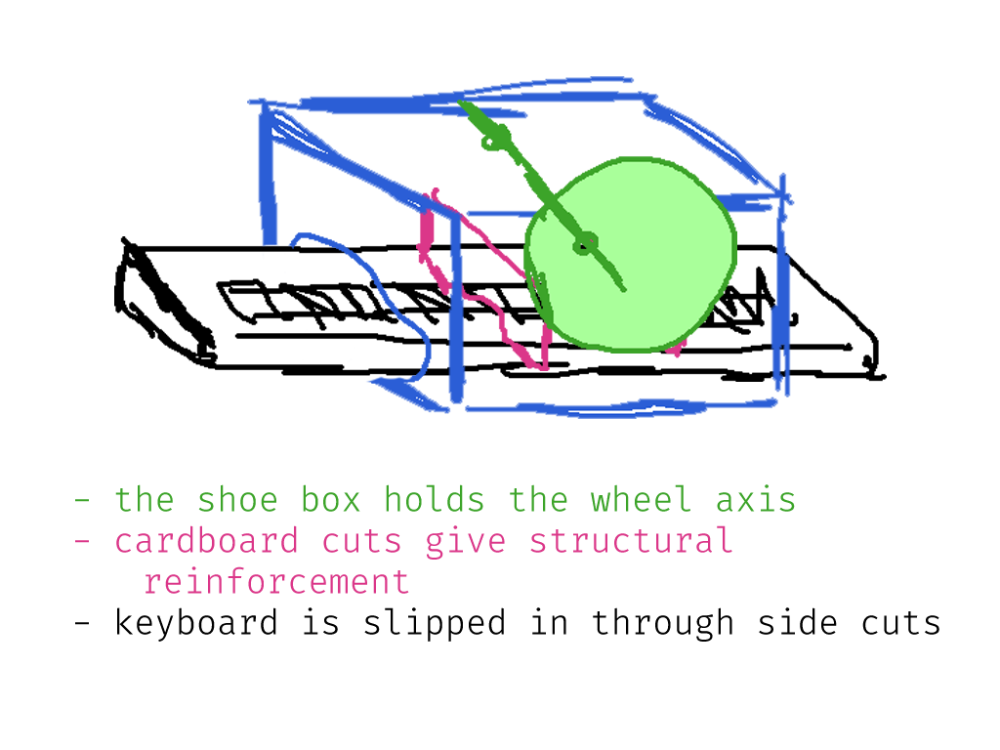
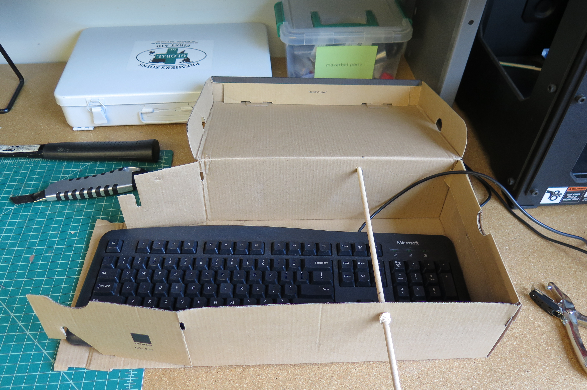
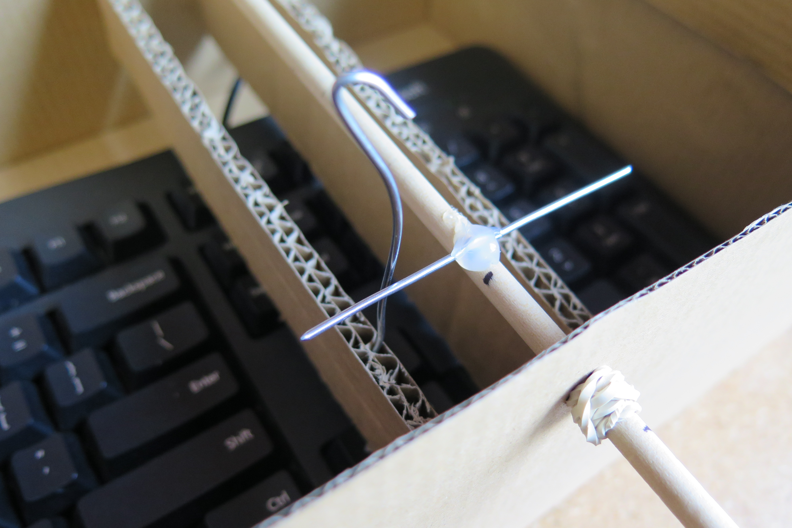
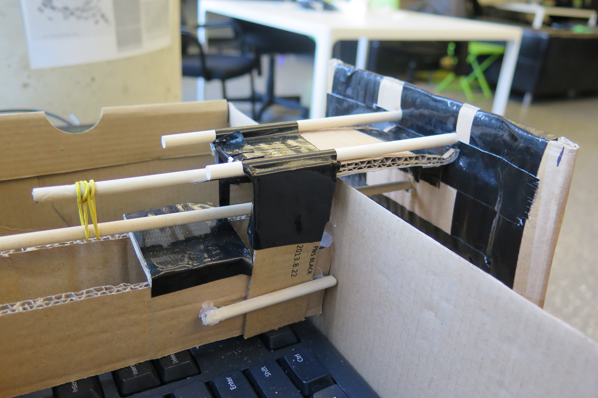
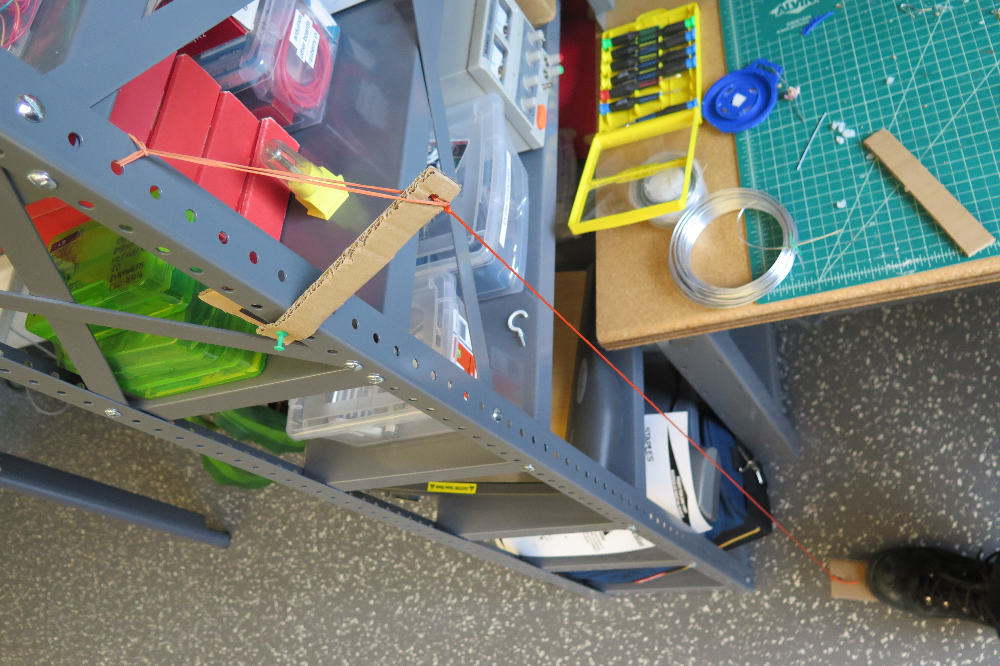
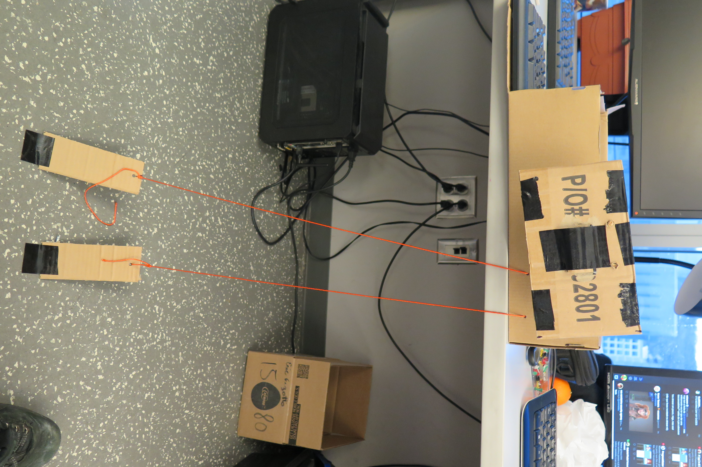
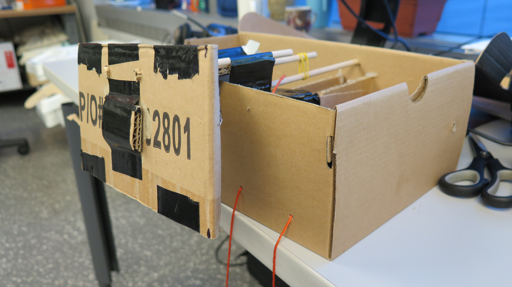
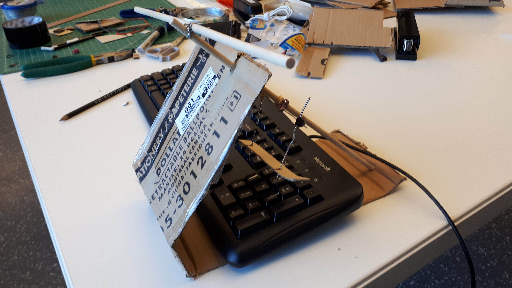
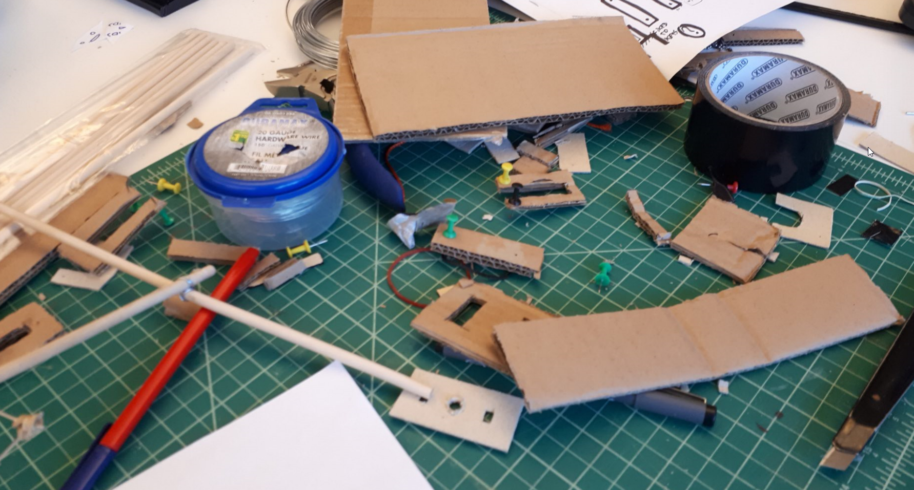
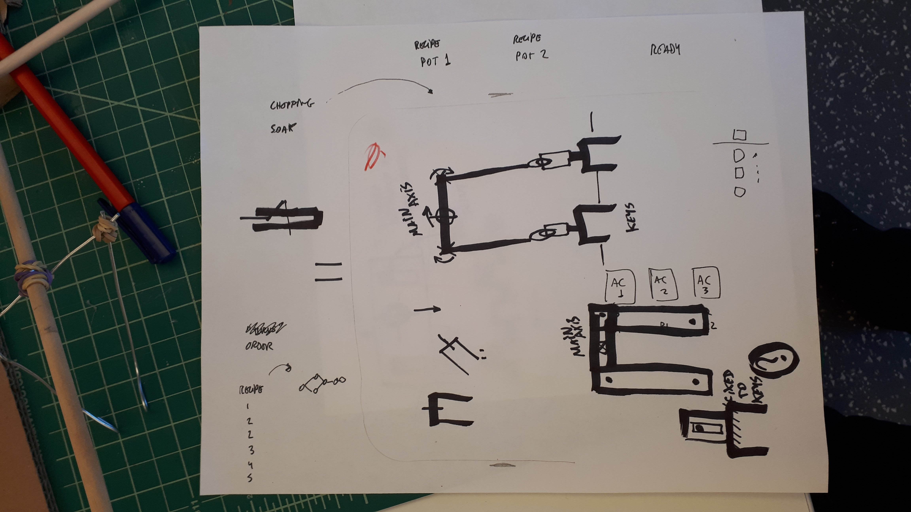

# Logs

## 2018-02-13

### 06 Cardboard research

After a weekend with fever and sick in bed, I managed to do some more work on finishing up and improving the Carrocalipse controller design. I researched about cardboard designs, both in terms of construction techniques and how to communicate the building of a specific object.

First, I found a variety of ways to joint surfaces (glue, notches, string, duct tape, plastic screws) and read some more about painting and finishing corrugated surfaces. These will be very helpful when coming up with more polished versions of controllers, but also should be considered from a perspective of ease of use and prior knowledge requirements. I prepared a reference board with some images from this research showing techniques and ideas I might use for future builds.  ~cardboard

// include ref board images later (at home pc)

Secondly, I also took notes on how Instructables and other websites structure their guides. They mostly use a manual-like **step-by-step** progression (which is very loosely applied in terms of consistent size / complexity of steps) with a big emphasis on photos. A major feature is the importance of **photo annotation**, with a simple tagging and hovering system built-in in the website. I also noted that the more professionalized or power-user the author, the more we see the use of Sketchup and other software for layouts and imagery. I'm considering following this system of acommunication more than the clean IKEA manual style or a LEGO like system like Nintendo chose for the Labo. I believe it's more approachable to extend and change as well as cheaper and flexible to produce.

#### Labo-like initiatives

While researching, I also found out about [make.do](http://make.do). This construction system for cardboard, while a very interesting junction of safety, technology and well-diagrammed presentation, shares similarities with the way Labo was presented by Nintendo. Both focus on safety, creativity rhetoric, a very sanitized version of creating things. In both the feeling of disorder is downplayed and very polished results are centered. There are also no failures, which is of course understandable from a perspective of marketing efforts. This presentation also makes me think how much they fit into Sutton-Smith's rhetoric of power with regards to children play (1997, ch. 11). They are threaded with rhetorics of power and progression (via contemporary values of creativity and skill-building in this case) enforced by adults, who hide whatever is seen as negative, irrational, and ultimately dangerous in children's play. I think this can be an interesting point to come back to when thinking about political subversion of Labo. ~rhetoric ~subversion ~cardboard

#### Materials and re-use

I've been thinking about the question of how the objects I choose to re-use shape the controller ideas I have. This is motivated by how well the shoebox worked as a basis for experimentation and, I believe, as an invitation (it's familiar / approachable). So, I'm considering experimenting with water bottles, milk cartons and other household recyclable materials for the next iterations. Let's see! ~recycling

## 2018-02-06

### 05 Second prototyping session

After a busy week with other projects, I started thinking about how to improve the first prototype. A major issue was the lack of structure, of a way to make it more sturdy so that the movable parts would work reliably. To solve that, I've thought of using a shoebox as the enveloping structure. This way, I can pass some bars / axis within the box to hold parallel walls together and make more sturdy supports for the inner parts (see sketch below). ~materials ~shoebox It's intriguing to think how one structural choice supported the whole design work from this on.

While working on the axis support, I noticed that using hot glue as a temporary material is quite good. It has some give, it's not completely rigid, but can be enough for small forces. Also, it made me think about how much each material "talks back" and the interplay between them. For instance, using rubber bands as tensioners to avoid in/out movement in the main axis or using cardboard holes as channels.

After a while, I decided to change from a rotating axis to a simplified swing. This decision was derived from playtesting, in which the wheel moved too much upwards, losing touch of the keys. By suggestion of the playtester (Ben), I added an extra dowel with a rubber band as tensioner to avoid undesired vertical movement. This gave the whole steering wheel much more stability and a nice resistance.

The forward-backward controls are pedals, which were relatively quick to make, as I had already learned a bit about reinforcing the cardboard with tape and using extra pieces to stabilize movement.

At the end of the session, the present prototype looks quite well finished and works ok with the game. It still lacks the action key (`Enter`) and changing key (`X`). I'll include these in the next work session.

#### Next steps

In this project I need to start preparing the documentation, so that the controller can be created by others. This is an important design process that I can definitely use later on my thesis, as I'm constantly concerned about circulation and access of alternative controllers.

A front in this is working out the last improvements I want to make in this design. My goals in that will be to simplify the materials, avoid as much as possible using hot glue or dowels, and find ways to make the project sturdier using mostly normal glue and tape. This also implies in making diagrams and step-by-step building manuals, which I'm considering making via annotated photographs. A question that I want to raise is how to make these look inviting and approachable, not as slick ready-made products. This is key to accessibility and also as this documentation could be used to support modding and workshops.  ~documentation ~graphic_design ~accessibility

An important next step is to decide on a new prompt for the next prototype, as discussed with Pippin. I'm interested in both approaches delineated below, so I'll try to think of ideas on both to pick for next prototype. ~design_prompt

**Prompt 1.** Work with an existing explicitly political game (one that would never make it past Nintendo's platform criteria of entry) and make a controller for it. The difference from the previous work would be that the focus of the controller would be to explore different metaphors than those in the game in ways that give more agency to the device or that radically alter (and ideally build and extend) the current play experience. That would mean change goals, mechanics, gameplay strategies in ways that lead to a stronger distancing from the game.

**Prompt 2.** Similarly to prompt 1, but I would on a work that is not explicitly political in its purpose. The goal of the controller making would be to subvert and make tangible a political argument through this game. This prompt would be relevant in thinking how to connect political alt controls with modding in political ways, which is a question I'd like to work on during the thesis. ~modding

## 2018-01-26

### 04 First prototyping session

First, I should note that this Wednesday I had a Skype call with Pedro Paiva and he agreed on me making a controller for [Carrocalipse](https://pedro-paiva.itch.io/carrocalipse). ~ethics I'll also be sending him materials of the prototypes and tests. From this, I started thinking about ways to turn the 4-direction and 2 action buttons into a car-like interface that would be sort of unusable for the Sokoban-Frogger gameplay. I believe it serves as a commentary within the world of the game: cars ruled the world, and now a car is playing (or being used to play) a game about surviving without cars.

I worked today on creating a first version of the controller. I focused mostly on the wheel, due to its complexity, as I have good ideas for how the up-down as throttle pedals or handles and the character changing as a gear shift. I'll work on these during next week.

There was a lot of back and forth in relation with how to translate the movement from a rotation to a vertical translation. I found an interesting way that is somewhat simple to assemble, but it will entail in keeping the axis parallel to the keyboard. The rotation axis will also need to have some slots for up-down free movement.  ~wheel

There was also a lot of testing with using rubber bands and other ways of joining pieces, as well as the possibilities of metal wires. It worked pretty well for this, as it didn't need to resist that much stress and was quick to rearrange and mold. I used quite a few pieces of cardboard to make 2D tests and basis for drawing and figuring out movements to try to implement in the keyboard device.

I considered the possibility of starting to use more elaborate electronics, but I've talked with Pippin and I'm leaning more towards the more mechanical focus. Keeping the electronic pieces intact works well. The cardboard contraption enveloping and extending the keyboard looks really nice and also connects well in relation with the Nintendo Labo "neatness" in fitting the JoyCon into the toys.

Another important aspect that I'm thinking for future design experiments is the sturdiness of the materials for the controller. I'll probably have to start experimenting with ways to make cardboard more resistant in a simple and DIY way. I'll do more research on that during the week.

As for documentation, we have tested tagging Pippin to notify about commits and notes, it seems to work alright. I've also taken some pictures of the setup, the prototype, and the work environment. I'm thinking that in future sessions it'd be good to do some form of cycle of annotations (at every X minutes / intervals, maybe?) and also making some more photo annotations to explain the details of the prototype. As soon as it's more usable, I'll also make some short videos. ~documentation ~meta

## 2018-01-19

### 03 Consent from creators

After talking to Carol about the project idea, she raised the point of asking creators permission to create controllers on top of their games. I agree that that's a good idea, so I'll also start preparing a short description of what it is that I'm doing in this project to send to creators before start working on the prototypes. Also, I'll start by asking my friend Pedro Paiva if I can create a controller for one of his games (maybe Mario Empalado or Carrocracia). I guess this is also a good point to talk with Pippin.

~ethics

### 02 After-meeting notes

So, the basic idea is to choose some small existing games and make controllers for them, mostly with a focus on mechanical extensions for existing hardware (mouse, keyboards, joypads, etc).

Some of the guiding themes would be:

- Try to keep the mechanical part of the projects more elaborate and keep the electronics as off-the-shelf or hackable out of cheap devices as possible.
- Documentation and DIY creation of the controllers created.
- Make controllers for existing games as a form of commentary and extension of those games.
- Also, it would be a form of commentary/pushback on the Nintendo Labo commodification of DIY practices, as I'm hoping to make controllers for games that would never be allowed on a closed corporate platform and that are focused on political critique.

In a sense, it makes me think of [Rudeism](https://www.twitch.tv/rudeism)'s controllers for playing and streaming games, but in this case it's much more related to the content of the games and not humor and performance.

We also agreed on meeting next week for discussing the first developments on the project. I'm looking forward to this project!

~meeting

### 01 Pre-meeting ideas & talking points

- Choice of tech: JS (tools, libraries, the game itself) sounds like a better choice. I want to move away from using Unity as soon as possible.
- Project style: could it be a tool? A game? A generic alt controller? Hacking + homebrewing?
- Choice of subject: still kind of open, but I'm mostly interested in tackling contemporary political issues. Some topics that come to mind:
  - Nintendo "Labour", cooptation and hacking.
  - Working rights dismantling, austerity, neoliberalism.
  - Immigration, language barrier?

~meeting
