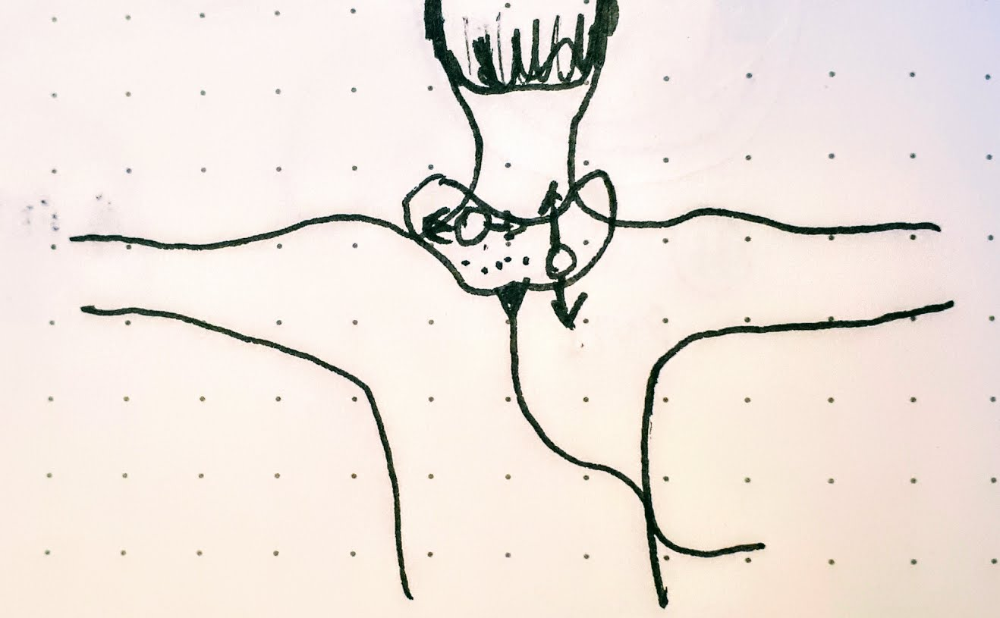
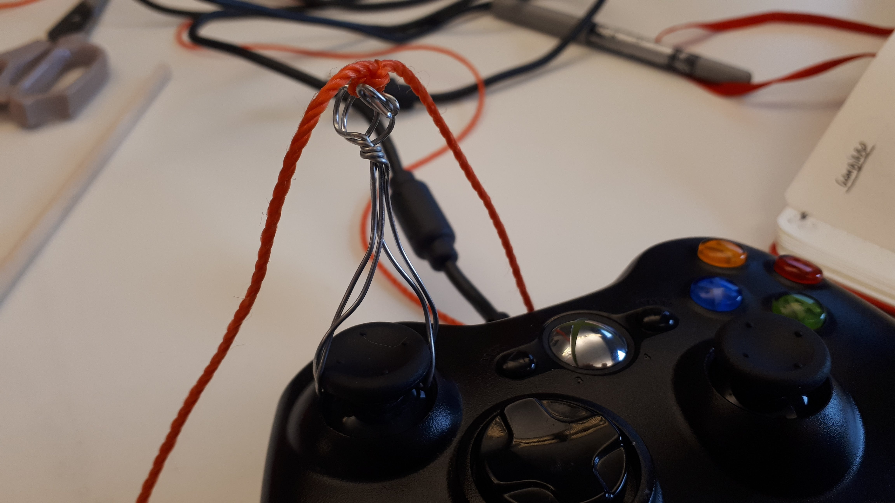
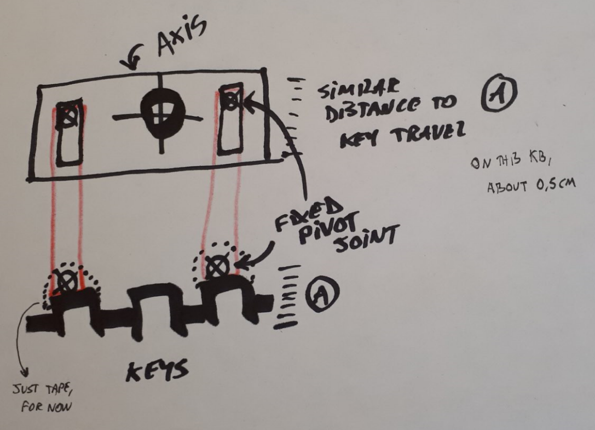

# Logs

## 2018-04-07

### Chindōgu

Andrea Peña told me about Chindōgu, a similar term as *gambiarra* but coming from Japan. It has a slightly different meaning, as it is meant as a form of satire and critique of usefulness, while gambiarra is usually connected to utility and necessity in a more direct way. After some research, I found some more info about the concept and it seems it was formulated by an artist-inventor called [Kenji Kawakami](https://www.amazon.com/101-Unuseless-Japanese-Inventions-Chindogu/dp/0393313697). Besides creating and promoting the concept in books and pieces of work, he mantains a website with a [10 tenets of Chindōgu](http://www.chindogu.com/?page_id=336) manifesto. It is really interesting and worth a read (as summarized by [this website](http://mentalfloss.com/article/61842/chindogu-art-unuseless)):

1. *A Chindōgu Cannot be for Real Use* — They must be, from a practical point of view, useless.
2. *A Chindōgu Must Exist* — A Chindōgu must be something that you can actually hold, even if you aren’t going to use it.
3. *There must be the Spirit of Anarchy in Every Chindōgu* — Chindōgu inventions represent the freedom to be (almost) useless and challenge the historical need for usefulness.
4. *Chindōgu Tools are for Everyday Life* — Chindōgu must be useful (or useless) to everyone around the world for everyday life.
5. *Chindōgu are Not for Sale* — Chindōgu cannot be sold, as this would go against the spirit of the art form.
6. *Humor is Not the Sole Reason for Creating a Chindōgu* — Even if Chindōgu are inherently quirky and hilarious, the main reason they are created is for problem solving.
7. *Chindōgu are Not Propaganda* — Chindōgu are, however, innocent and made with good intentions. They should only be created to be used (or not used).
8. *Chindōgu are Never Taboo* — Chindōgu must adhere to society’s basic standards.
9. *Chindōgu Cannot be Patented* — Chindōgu cannot be copyrighted or patented, and are made to be shared with the rest of the world.
10. *Chindōgu Are Without Prejudice* — Everyone should have an equal chance to enjoy every Chindōgu.

I find it really interesting how this relates to toys and playful objects (such as game controllers). Chindōgu seems to sit firmly within the realm of play as frivolous, as just the sot of object a jester would wear and use to annoy a noble court, while also claiming an ambiguous utility. They seem disruptive and a great materialized comment on material cultural, the work objects do, and playfulness.

Also interesting to see the emphasis on accessibility and freedom of circulation: access is necessary, re-creation is open, they should have "good intentions" and fit into society to an extent, while critiquing it. I think my position with alternative controllers is very similar in many aspects, and my worry with the Nintendo Labo sort of stems from a similar place than Kawakami's manifesto. How to keep the subversive potential of alternative controllers and their push against efficiency and transparency (the equivalents of usefulness)?

## 2018-04-06

### CS:GO surfing test

I downloaded CS:GO and some surfing maps. They were fun and interesting to play. It is a difficult play mode, as it feels very counterintuitive. I'm getting more skeptical that I can build a controller extension that enables it without any electronic customization, the fluidity depends a lot of settings and very subtle movements alternated with quick ones.

Also, I stumbled into a very tangible barrier: I hade a very strong nausea after playing around 15 minutes of the game mode. All the falling and fast first-person perspective got me. I'm thinking I won't be able to continue this design direction.

### Cardboard research

As a part of the research on how to extend the thumbstick movements of the joystick, I'm looking into mechanical possibilities of cardboard. Some interesting things are cardboard hinges using hardware like nuts, bolts and washers. They are not as accessible as plain cardboard and duct tape, but are still quite cheap and easy to find and re-adapt.

### GambiCon01 improvements

While researching some hinges, I stumbled upon an interesting design for an axis, using two pieces of cardboard on a cross position. This seems like a better arrangement for the GambiCon01 driving wheel, so I'm looking at making a new version of it that is better to document and can be made with a clearer design. Also, removing dowels as much as possible.

## 2018-04-05

### CS Surfing research

- A couple of videos on surfing: [1](https://youtu.be/0wHbVWoKoIs), [2](https://youtu.be/8_PzCot7Sj0).

According to this, this is an artifact of the physics in the game (specifically the Source engine). It was discovered by players who then created custom maps to explore these bugs. It might also be as something that originated on Quake and other older shooters.

Important factors for surfing play. [Here is a how-to with a few tips](http://crosshairgenerator.com/how-to/how-to-surf-in-counter-strike/):

1. Crosshair placement (usually the mouse cursor)
2. Strafing "against" the angled surface (A & D keys)

Both are mostly thumbstick related movement in a gamepad.

## 2018-04-03 Choice of 3rd game

### Prompt & initial design constraints

Ok, so the prompt I had settled on was to work the 3rd GambiCon from a gamepad. From the start some of the basics of the idea were to:

- Move away from using hand and finger movements in general. This would also apply to the grip and holding of the controller, so I'd focus on connecting different body parts to the gamepad grip, play around with the shapes left-over from its hand ergonomics. An effect I'm interested in is in the amplification in scale of the fine movements of thumbs.

  

- Remove part of the multi-modal and simultaneous inputs used in gamepad-focused control schemes in games. I believe it would be interesting when trying to subvert or expand on an existing game.

### Inspiration games

When looking for games to make this controller for, I thought of first-person games. Both because there is quite a variety of them, but also because they are a very charged genre, very disputed. A few of the games I'm considering right now are:

- [North](https://outlands.itch.io/north). Arm gestures as the inadequacy of passing in a new country, and the subdued experience of walking while migrant.

- [Proteus](https://twistedtree.itch.io/proteus)
Turn the exploration of the island into a dance of strings and arm movements. Prob not super political, though.

- Any military fps, basically. The point is that I would remove access to any shooting / action buttons. Just move and run and try to survive as long as possible. In a sense it would be a controller custom-made for making "pacifist runs" in these games: a pacifist controller?

- [CS:GO](http://store.steampowered.com/app/730/CounterStrike_Global_Offensive/). Another variation of that would be to make the controller specifically for [surfing in CS:GO](https://youtu.be/sf8o2GdSDio?t=126) ([another example](https://youtu.be/-0orkZ3gMfQ?t=25)). It would be about a DIY practice extending another, one that already has a certain subversion of combat movements into choreography that is interesting in itself.

### Accessibility and gamepads

A point to consider while I'm thinking of modding and extending gamepads is how this relates to work done by the accessibility modding community and assistive technologies (both in terms of professional and [DIY designs](http://www.instructables.com/member/shadowwynd/)) in general. Many designs and DIY guides exist to help customize gamepads to make them usable by folks with different disabilities. Here is an example [guide](http://www.oneswitch.org.uk/art.php?id=76) about changing thumbstick strength for accessible alternatives. I want to be very conscious, as I experiment with different gamepad attachments and extensions, to not make the different relationship of the controller with the body be the only transformation at play or to make that difference from convention be the main point of the game. Accessible controllers and extensions are a huge topic and I worry that my controller might come off as downplaying their importance or appropriating their designs in offensive and ableist ways. This is an important point that I'll certainly come back to.  ~accessibility

### Extending thumbsticks

Here's an overview of today's experiments:

1. Attaching string directly to the thumbstick, so that players could pull to move. However, the  (with thickness of string and angles would hinder arm movement.
2. Then, I tried extending the stick with wire structures that I can attach the string to. By making the string connection indirect, the angles of movement became better, but it became a very fragile structure.

  

  Some structures ended up being better, especially for 1D movement, which is quite ok for forward / backwards control in a FPS game. I don't need necessarily to support strafing, after all.

  

3. Then, I experimented with cardboard as a material for connecting the string to the thumbstick, in the shape of a bread-bag-closing-piece. Good results overall. It would work better with a very dense cardboard, to make the hole punching and setup easier. It also doesn't improve much the arm movement angle issue. As soon as I have a clearer picture of what game I'll work on, than I might revisit this system.

  

4. By this point, I could see 1D movement working quite well. However, I also wanted to have some 2D movement options. I did some tests using string-only harnesses, both with many threads or single threaded. knotted. They worked well in terms of fine movement and resistance, but they could be a bit tricky to setup. Also, the number of threads / strings didn't matter much, so the simpler the better.

  

  

5. Finally, I tested a longer piece of cardboard as an attachment to the thumbstick. That was quite easy to secure and provided good and fine-tuned 1D movement. Might be one of the sturdiest alternatives so far.

  

All these experiments involved fixing the controller somewhere. The neck position was ok for playing, but annoying for testing. I'm also considering other arrangements, like using a stand to fix the gamepad in place.

## 2018-03-23

During this last week, I've been writing the project website and the instructions for building the mining sieve controller. I'm almost done with the written instructions and I have the draft a bit more advanced. I'll work on diagrams and photos on Monday. I'm aiming to post them on Monday or Tuesday.

The process took longer than I expected because I got caught up on templating and webdesign, which really is not a big priority. In a tangent, a part of it was the fact that I ended up learning much about EJS templating and a workflow for creating static websites using NodeJS, which is a tech stack that I've been using for a while. I had been looking for ways to generate static sites, because I like using them to document projects and also to organize educational materials and info. Also, I found out that it integrates with GitHub in a quick and easy way to use. I believe that drifting into this was actually quite productive, as it will really help in the documentation of other projects, such as my Reflective Game Design game and future thesis work.

I've also been thinking about how to evaluate if the instruction materials are good. An idea I have is to send to few friends who do alt ctrl work and try to get feedback on how to improve it.

Another aspect that I did some work during these last work sessions was on deciding which license to use for the project. I want to use either a public domain or copyleft license, but I've been checking on the different terms and I'm a bit divided on which to pick. GPL is not really suited to things outside from code and BSD or MIT licenses allow for commercial work in ways that I worry could potentially result in closed-up versions of the controller. Also I'm not necessarily against commercial uses of the designs, as long as they are also accessible to others for free. So, I'm inclined right now to use a Creative Commons license with just a Share-Alike restriction, which would keep the derivative design still accessible to others to re-create and use.

## 2018-03-09

### 09 4th Prototyping session

Today I built the larger mining sieve.

- large mining sieve
  - better lip-sleeve mechanisms
  - printing the cut and fold diagram in many letter-sized sheets of paper
  - tests with duct tape for reinforcement (both of the lips and of the side connections)
- rocks + weight testing
- improve the mouse station (duct tape)

## 2018-03-02

### 08 3rd Prototyping session

#### Prep and planning

- Research pizza box schematics for mining sieve piece.
- Sketch the mouse-based mining sieve controller.
- Build first version.
- Test, review and correct.

The basic concept for the controller consists of two parts. Part one is a pizza-box-like

I researched some pizza box patents and schematics. I found an [interesting one](https://patents.google.com/patent/US5961035A/en?q=pizza&q=box&oq=pizza+box) with a good fold-and-cut diagram, as well as an interesting looking pentagonal shape. I made a small construction paper model, with a modification to remove the lid and keep it just the open bottom part.

*Up: Simple double lip & sleeve modification to remove the box lid.*

It's a glue-less build and it would be easy to create documentation, as it builds on an existing diagram. I like the idea of it being a patent rip-off and modification too, as this is a big question relating to how Nintendo will manage its own cardboard diagrams and toy ecosystem (especially the digital part).

The small scale model looks quite ok, but it's too small and flimsy to actually playtest the controller. Before I make the larger scale sieve, I'm going to prototype the mouse-holder base. It needs to be able to hold the mouse in position while exposing the laser sensor for navigation and having some play for clicking by pressing over the upside-down mouse.

## 2018-02-24

### 07 Cardboard mining

I've been thinking about the next game + controller project lately. I've decided to focus on creating a controller about abstract labor / work that turns the in-game labor into a very concrete activity. This would be done by resisting the pace of the game via the physical constraints of the controller. Thematically, I started thinking about taking a game like [Universal Paperclips](http://www.decisionproblem.com/paperclips/index2.html), but I think its central topic is more about AI and abstraction and less about work. After some reflection, I think a good topic would be commenting on cryptocurrency fetish as a narrative that elevates automation and value to an abstracted form. Also, there are a few games that take on Bitcoin mining as a topic and I think they would lend themselves well to creating mechanical controllers.

#### Example games

Here's a list of a few games I was trying out to use in this project.

- [Downbit](https://5mixer.itch.io/downbit): It's more of a fun example, but it doesn't have the explicit bitcoin metaphor which I think would make the controller's concept clearer. It would require a mouse + click functionality, which would not be too difficult to make with a cardboard plane (pizza box) + some weights (rocks).

- [Code clicker](https://oldmancharles.itch.io/code-clicker): It's a more "active" game, it requires a lot of clicking and feels even more pointless than Downbit. It's much less "refined" in terms of visual polish and feedback and it uses some game design conventions of classic Flash games (the completist inventory and raising prices). This would be a good fit for the game overall, as it doesn't have a very explicit stance on cryptocurrencies and that would be proposed more by the use of the controller itself.

- [Bitcoin Mining Simulator](https://brodiemongon.itch.io/bitcoin-mining-simulator): It's an ASCII based game that uses keyboard for input, so it would fit less with the idea of using the mouse. At the same time, it's the game with a clearer satirical stance, with a "take over the world" metaphor for the "get rich with less effort" entrepreneurial discourse of cryptocurrencies. I'm tempted to try to make a casing for the keyboard that would allow the player to press only the number keys, enter and backspace using a (fake) pickaxe. It could also use the mining sieve controller or maybe a pickaxe for hitting the number keys (more details below).

- [Bitcoin digger](https://hubix9.itch.io/bitcoin-digger): It's another very classic idle game. I like the starkness of it, but there are a few bugs and the game is really slow. It would be difficult for players to "get" the game in a shorter play session.

#### Controller mechanisms

For the mouse-based controller ideas, I'm thinking of using a mining sieve metaphor, with a pizza box lid as a plane holding rocks. With this mining sieve, the player would slide the plane over a fixed upside-down mouse to move the cursor and press against it to force the left-click to happen. So, players would very literally be bitcoin mining.

As for keyboard based games, a pickaxe would be used to hit labelled sticks that are pointing out from a shoebox (and touching the appropriate keys), filling up the commands and actions to be performed. It's a very simple idea, but depending on how heavy  and clunky I can make the pickaxe, i think it could work well.

I also like using the mining sieve and pickaxe metaphors for the controllers because they tap on a similar narrative and metaphor that the cryptocurrency creators themselves use to situate, explain and popularize their technology. By calling it "mining" they tap into the symbolic lure of gold-rush-like instant wealth and its gambling characteristic. I'd like to make that more explicit in the controller, play with the humour aspect of it too.

#### Next steps

I'll start prototyping the mouse-based controller with the Code Clicker game, to see how well it will work. I'll also keep researching to see if i can find a game that is a better fit (cryptocurrency theme + critique + mouse-based input), I might be able to find a better example than what I have so far.

## 2018-02-13

### 06 Cardboard research

After a weekend with fever and sick in bed, I managed to do some more work on finishing up and improving the Carrocalipse controller design. I researched about cardboard designs, both in terms of construction techniques and how to communicate the building of a specific object.

First, I found a variety of ways to joint surfaces (glue, notches, string, duct tape, plastic screws) and read some more about painting and finishing corrugated surfaces. These will be very helpful when coming up with more polished versions of controllers, but also should be considered from a perspective of ease of use and prior knowledge requirements. I prepared a reference board with some images from this research showing techniques and ideas I might use for future builds.  ~cardboard

Secondly, I also took notes on how Instructables and other websites structure their guides. They mostly use a manual-like **step-by-step** progression (which is very loosely applied in terms of consistent size / complexity of steps) with a big emphasis on photos. A major feature is the importance of **photo annotation**, with a simple tagging and hovering system built-in in the website. I also noted that the more professionalized or power-user the author, the more we see the use of Sketchup and other software for layouts and imagery. I'm considering following this system of communication more than the clean IKEA manual style or a LEGO like system like Nintendo chose for the Labo. I believe it's more approachable to extend and change as well as cheaper and flexible to produce.

#### Labo-like initiatives

While researching, I also found out about [make.do](http://make.do). This construction system for cardboard, while a very interesting junction of safety, technology and well-diagrammed presentation, shares similarities with the way Labo was presented by Nintendo. Both focus on safety, creativity rhetoric, a very sanitized version of creating things. In both the feeling of disorder is downplayed and very polished results are centered. There are also no failures, which is of course understandable from a perspective of marketing efforts. This presentation also makes me think how much they fit into Sutton-Smith's rhetoric of power with regards to children play (1997, ch. 11). They are threaded with rhetorics of power and progression (via contemporary values of creativity and skill-building in this case) enforced by adults, who hide whatever is seen as negative, irrational, and ultimately dangerous in children's play. I think this can be an interesting point to come back to when thinking about political subversion of Labo. ~rhetoric ~subversion ~cardboard

#### Materials and re-use

I've been thinking about the question of how the objects I choose to re-use shape the controller ideas I have. This is motivated by how well the shoebox worked as a basis for experimentation and, I believe, as an invitation (it's familiar / approachable). So, I'm considering experimenting with water bottles, milk cartons and other household recyclable materials for the next iterations. Let's see! ~recycling

## 2018-02-06

### 05 Second prototyping session

After a busy week with other projects, I started thinking about how to improve the first prototype. A major issue was the lack of structure, of a way to make it more sturdy so that the movable parts would work reliably. To solve that, I've thought of using a shoebox as the enveloping structure. This way, I can pass some bars / axis within the box to hold parallel walls together and make more sturdy supports for the inner parts (see sketch below). ~materials ~shoebox It's intriguing to think how one structural choice supported the whole design work from this on.

While working on the axis support, I noticed that using hot glue as a temporary material is quite good. It has some give, it's not completely rigid, but can be enough for small forces. Also, it made me think about how much each material "talks back" and the interplay between them. For instance, using rubber bands as tensioners to avoid in/out movement in the main axis or using cardboard holes as channels.

After a while, I decided to change from a rotating axis to a simplified swing. This decision was derived from playtesting, in which the wheel moved too much upwards, losing touch of the keys. By suggestion of the playtester (Ben), I added an extra dowel with a rubber band as tensioner to avoid undesired vertical movement. This gave the whole steering wheel much more stability and a nice resistance.

The forward-backward controls are pedals, which were relatively quick to make, as I had already learned a bit about reinforcing the cardboard with tape and using extra pieces to stabilize movement.

At the end of the session, the present prototype looks quite well finished and works ok with the game. It still lacks the action key (`Enter`) and changing key (`X`). I'll include these in the next work session.

#### Next steps

In this project I need to start preparing the documentation, so that the controller can be created by others. This is an important design process that I can definitely use later on my thesis, as I'm constantly concerned about circulation and access of alternative controllers.

A front in this is working out the last improvements I want to make in this design. My goals in that will be to simplify the materials, avoid as much as possible using hot glue or dowels, and find ways to make the project sturdier using mostly normal glue and tape. This also implies in making diagrams and step-by-step building manuals, which I'm considering making via annotated photographs. A question that I want to raise is how to make these look inviting and approachable, not as slick ready-made products. This is key to accessibility and also as this documentation could be used to support modding and workshops.  ~documentation ~graphic_design ~accessibility

An important next step is to decide on a new prompt for the next prototype, as discussed with Pippin. I'm interested in both approaches delineated below, so I'll try to think of ideas on both to pick for next prototype. ~design_prompt

**Prompt 1.** Work with an existing explicitly political game (one that would never make it past Nintendo's platform criteria of entry) and make a controller for it. The difference from the previous work would be that the focus of the controller would be to explore different metaphors than those in the game in ways that give more agency to the device or that radically alter (and ideally build and extend) the current play experience. That would mean change goals, mechanics, gameplay strategies in ways that lead to a stronger distancing from the game.

**Prompt 2.** Similarly to prompt 1, but I would on a work that is not explicitly political in its purpose. The goal of the controller making would be to subvert and make tangible a political argument through this game. This prompt would be relevant in thinking how to connect political alt controls with modding in political ways, which is a question I'd like to work on during the thesis. ~modding

## 2018-01-26

### 04 First prototyping session

First, I should note that this Wednesday I had a Skype call with Pedro Paiva and he agreed on me making a controller for [Carrocalipse](https://pedro-paiva.itch.io/carrocalipse). ~ethics I'll also be sending him materials of the prototypes and tests. From this, I started thinking about ways to turn the 4-direction and 2 action buttons into a car-like interface that would be sort of unusable for the Sokoban-Frogger gameplay. I believe it serves as a commentary within the world of the game: cars ruled the world, and now a car is playing (or being used to play) a game about surviving without cars.

I worked today on creating a first version of the controller. I focused mostly on the wheel, due to its complexity, as I have good ideas for how the up-down as throttle pedals or handles and the character changing as a gear shift. I'll work on these during next week.

There was a lot of back and forth in relation with how to translate the movement from a rotation to a vertical translation. I found an interesting way that is somewhat simple to assemble, but it will entail in keeping the axis parallel to the keyboard. The rotation axis will also need to have some slots for up-down free movement.  ~wheel

There was also a lot of testing with using rubber bands and other ways of joining pieces, as well as the possibilities of metal wires. It worked pretty well for this, as it didn't need to resist that much stress and was quick to rearrange and mold. I used quite a few pieces of cardboard to make 2D tests and basis for drawing and figuring out movements to try to implement in the keyboard device.

I considered the possibility of starting to use more elaborate electronics, but I've talked with Pippin and I'm leaning more towards the more mechanical focus. Keeping the electronic pieces intact works well. The cardboard contraption enveloping and extending the keyboard looks really nice and also connects well in relation with the Nintendo Labo "neatness" in fitting the JoyCon into the toys.

Another important aspect that I'm thinking for future design experiments is the sturdiness of the materials for the controller. I'll probably have to start experimenting with ways to make cardboard more resistant in a simple and DIY way. I'll do more research on that during the week.

As for documentation, we have tested tagging Pippin to notify about commits and notes, it seems to work alright. I've also taken some pictures of the setup, the prototype, and the work environment. I'm thinking that in future sessions it'd be good to do some form of cycle of annotations (at every X minutes / intervals, maybe?) and also making some more photo annotations to explain the details of the prototype. As soon as it's more usable, I'll also make some short videos. ~documentation ~meta

## 2018-01-19

### 03 Consent from creators

After talking to Carol about the project idea, she raised the point of asking creators permission to create controllers on top of their games. I agree that that's a good idea, so I'll also start preparing a short description of what it is that I'm doing in this project to send to creators before start working on the prototypes. Also, I'll start by asking my friend Pedro Paiva if I can create a controller for one of his games (maybe Mario Empalado or Carrocracia). I guess this is also a good point to talk with Pippin.

~ethics

### 02 After-meeting notes

So, the basic idea is to choose some small existing games and make controllers for them, mostly with a focus on mechanical extensions for existing hardware (mouse, keyboards, joypads, etc).

Some of the guiding themes would be:

- Try to keep the mechanical part of the projects more elaborate and keep the electronics as off-the-shelf or hackable out of cheap devices as possible.
- Documentation and DIY creation of the controllers created.
- Make controllers for existing games as a form of commentary and extension of those games.
- Also, it would be a form of commentary/pushback on the Nintendo Labo commodification of DIY practices, as I'm hoping to make controllers for games that would never be allowed on a closed corporate platform and that are focused on political critique.

In a sense, it makes me think of [Rudeism](https://www.twitch.tv/rudeism)'s controllers for playing and streaming games, but in this case it's much more related to the content of the games and not humor and performance.

We also agreed on meeting next week for discussing the first developments on the project. I'm looking forward to this project!

~meeting

### 01 Pre-meeting ideas & talking points

- Choice of tech: JS (tools, libraries, the game itself) sounds like a better choice. I want to move away from using Unity as soon as possible.
- Project style: could it be a tool? A game? A generic alt controller? Hacking + homebrewing?
- Choice of subject: still kind of open, but I'm mostly interested in tackling contemporary political issues. Some topics that come to mind:
  - Nintendo "Labour", cooptation and hacking.
  - Working rights dismantling, austerity, neoliberalism.
  - Immigration, language barrier?

~meeting
